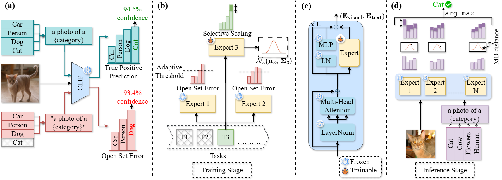

# [Mixing Expertise with Confidence: A Mixture of Experts Framework for Robust Multi-Modal Continual Learning](https://openreview.net/pdf?id=ZPJbTXMYft)
**[Forty-third International Conference on Machine Learning](https://icml.cc/virtual/2026/poster/63173)** - **[ICML 2026](https://icml.cc/virtual/2026/poster/63173)**
___
## Approach


___

The repository covers three continual-learning settings:


| Setting                                | Benchmark                               |
| -------------------------------------- | --------------------------------------- |
| Class-Incremental Learning (CIL)       | CIFAR-100, TinyImageNet-200, ImageNet-R |
| Subpopulation Shift                    | BREEDS (Entity-13 / Entity-30)          |
| Cross-domain Task-Agnostic IL (X-TAIL) | 11 vision datasets                      |


## Results

Pre-computed metrics from our experiments are included in the repository (click to open):

### Class-Incremental Learning (CIL)


| Experiment           |
| -------------------- | 
| [CIFAR-100 (10 Step)](experiments/class/cifar100_10-10-MoE_Confidence/metrics.json), [CIFAR-100 (20 Step)](experiments/class/cifar100_5-5-MoE_Confidence/metrics.json), [CIFAR-100 (50 Step)](experiments/class/cifar100_2-2-MoE_Confidence/metrics.json)    | 
| [TinyImageNet (5 Step)](experiments/class/tinyimagenet_100-20-MoE_Confidence/metrics.json), [TinyImageNet (10 Step)](experiments/class/tinyimagenet_100-10-MoE_Confidence/metrics.json), [TinyImageNet (20 Step)](experiments/class/tinyimagenet_100-5-MoE_Confidence/metrics.json) |
| [ImageNet-R (B0 Inc20)](experiments/class/imagenet_R_20-20-MoE_Confidence/metrics.json)    |


### Sub-population Shift Incremental Learning (BREEDS)


| Experiment         |
| ------------------ |
| [Entity-* (* steps)](experiments/class/breeds-MoE_Confidence/) |


### Cross-domain Task-Agnostic IL (X-TAIL)


| Experiment     |
| -------------- |
| [X-TAIL (11×11)](X-TAIL/output_eval_clean.txt) |


---

## Installation

We recommend using the provided Conda environment (Python 3.9, PyTorch 2.4, CUDA 12.1):

```bash
conda env create -f environment.yml
conda activate MoE_Confidence
```

---

## Class-Incremental Learning

### Datasets


| Dataset          | Classes | Splits in this repo   | Notes                                   |
| ---------------- | ------- | --------------------- | --------------------------------------- |
| CIFAR-100        | 100     | 2-2, 5-5, 10-10       | Auto-downloaded to `data/cifar100/`     |
| TinyImageNet-200 | 200     | 100-5, 100-10, 100-20 | Auto-downloaded to `data/tinyimagenet/` |
| ImageNet-R       | 200     | 20-20                 | Manual download; see below              |


**Class order** files live in `class_orders/` and follow [MoE-Adapters4CL](https://github.com/JiazuoYu/MoE-Adapters4CL) (CIFAR-100, TinyImageNet) and [RAPF](https://github.com/linlany/RAPF) (ImageNet-R). See `class_orders/Readme.md` for details.

### ImageNet-R preparation

1. Download [ImageNet-R](https://github.com/hendrycks/imagenet-r) and place images under `data/imagenet_R/`.
2. Use the train/val split in `imgr_split/imgr_train_test_split.txt` (from [RAPF](https://github.com/linlany/RAPF/tree/main/imgr_split)).

Expected layout:

```plaintext
data/imagenet_R/
├── train/
│   ├── n01443537/
│   └── ...
└── val/
    ├── n01443537/
    └── ...
```

### Run examples

Single GPU:

```bash
CUDA_VISIBLE_DEVICES=0 python main_ddp.py \
    --config-path configs/class \
    --config-name cifar100_5-5.yaml \
    class_order=class_orders/cifar100.yaml
```

Multi-GPU (DDP):

```bash
CUDA_VISIBLE_DEVICES=0,1 TORCH_NPROC=2 bash run_all_class_configs.sh
```

Or run a specific config:

```bash
CUDA_VISIBLE_DEVICES=0,1 TORCH_NPROC=2 bash run_all_class_configs.sh --config-name tinyimagenet_100-10.yaml
```

---

## Subpopulation Shift (BREEDS)

We follow the [BREEDS Benchmarks](https://openreview.net/forum?id=mQPBmvyAuk) protocol on ILSVRC2012, using the incremental task definitions in `breeds_protocol/`. See `breeds_protocol/Readme.md` for the reference protocol ([ISL](https://github.com/wuyujack/ISL)).

### Data preparation

1. **Download ImageNet** and organize it as:
  ```plaintext
   /ILSVRC/Data/CLS-LOC/
   ├── train/
   │   ├── n03388549/
   │   └── ...
   └── val/
       ├── n03388549/
       └── ...
  ```
2. **Configure paths** in the corresponding `main_breeds*.py` script:
  ```python
   data_dir = "/ILSVRC/Data/CLS-LOC/"
   info_dir = "/ILSVRC/imagenet_class_hierarchy/modified/"
   task_stat_path = "/path/to/MoE-Confidence/breeds_protocol/entity13_5_tasks.pkl"
  ```
   Download the ImageNet class hierarchy from the [BREEDS-Benchmarks repo](https://github.com/MadryLab/BREEDS-Benchmarks/tree/master/imagenet_class_hierarchy/modified).

### Run examples

```bash
CUDA_VISIBLE_DEVICES=0 python main_breeds13-5.py \
    --config-path configs/class \
    --config-name any_breeds.yaml
```

Results are saved under `experiments/class/breeds-MoE_Confidence/`.

---

## Cross-domain Task-Agnostic Incremental Learning (X-TAIL)

We evaluate on the 11-dataset X-TAIL benchmark:

**Aircraft, Caltech101, CIFAR100, DTD, EuroSAT, Flowers, Food, MNIST, OxfordPet, StanfordCars, SUN397**

### Data preparation

Download and prepare each dataset following the instructions in [ZSCL datasets.md](https://github.com/Thunderbeee/ZSCL/blob/main/mtil/datasets.md), then place them under a single root directory (e.g. `X-TAIL/data/`). See `X-TAIL/README.md` for layout and commands.

### Training

Edit paths at the top of `X-TAIL/run_train.sh`, then:

```bash
cd X-TAIL
bash run_train.sh
```

### Evaluation

Edit paths in `X-TAIL/run_eval.sh`, then:

```bash
cd X-TAIL
bash run_eval.sh
```

This evaluates every learned expert on every dataset and reports the fusion accuracy matrix via `src/xtail_accuracy.py`. The log is written to `X-TAIL/output_eval_clean.txt` by default.

Summarize the [X-TAIL](https://github.com/linghan1997/Regression-based-Analytic-Incremental-Learning) accuracy matrix: 

```bash
python3 -m src.xtail_accuracy --log-path output_eval_clean.txt --num-tasks 11
```

---

## Citation

If you find this work useful, please cite:

```bibtex
@inproceedings{
Forhad2026mixing,
title={Mixing Expertise with Confidence: A Mixture of Experts Framework for Robust Multi-Modal Continual Learning},
author={Md Abdullah Al Forhad and Yuansheng Zhu and Abhinab Acharya and Xumin Liu and Qi Yu and Weishi Shi},
booktitle={Forty-third International Conference on Machine Learning},
year={2026},
url={https://openreview.net/forum?id=ZPJbTXMYft}
}
```

---

## Acknowledgements

This work is inspired and supported by the following repositories: [ZSCL](https://github.com/Thunderbeee/ZSCL), [MoE-Adapters4CL](https://github.com/JiazuoYu/MoE-Adapters4CL), [BREEDS Benchmarks](https://github.com/MadryLab/BREEDS-Benchmarks), [ISL](https://github.com/wuyujack/ISL), [Continual-CLIP](https://github.com/vgthengane/Continual-CLIP), [RAIL](https://github.com/linghan1997/Regression-based-Analytic-Incremental-Learning).

We gratefully acknowledge their contributions to the research community.
